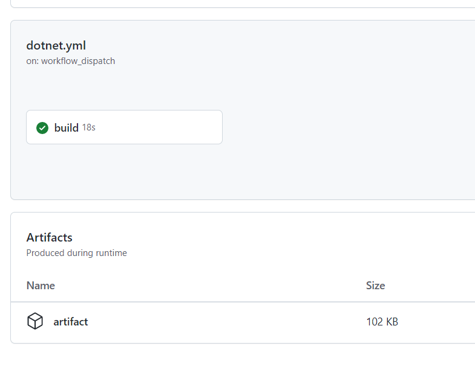
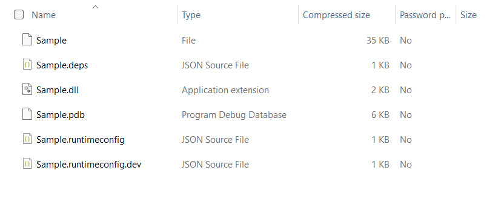

# Setting up SBOM generation for GitHub Actions

This document provides an example on how to integrate SBOM tool into GitHub Actions, you may use this as a guide to adding the tool to your GitHub action.

## Existing setup

In our Github project, the source contains a project called Sample. We also have a workflow that builds the project and saves the generated binaries as a pipeline artifact.

```yaml
name: Sample

on: 
  workflow_dispatch:

jobs:
  build:

    runs-on: ubuntu-latest

    steps:
    - uses: actions/checkout@v3
    - name: Setup .NET
      uses: actions/setup-dotnet@v2
      with:
        dotnet-version: 6.0.x

    - name: Build
      run: dotnet build Sample.sln --output buildOutput

    - name: Upload a Build Artifact
      uses: actions/upload-artifact@v3.1.0
      with:
        path: buildOutput
```

Upon generation, we see that the artifacts are uploaded to the Actions run page, the generated binaries and other files are placed in the artifact.




## Adding the SBOM generation task

We will generate the SBOM for the build artifacts we generate in the previous step. We will store the generated SBOM as part of the build artifacts, as we will be distributing this artifact to our downstream dependencies. 

```yaml
name: Sample with SBOM generation

on: 
  workflow_dispatch:

jobs:
  build:

    runs-on: ubuntu-latest

    steps:
    - uses: actions/checkout@v3
    - name: Setup .NET
      uses: actions/setup-dotnet@v2
      with:
        dotnet-version: 6.0.x
    - name: Build
      run: dotnet build Sample.sln --output buildOutput
      
    - name: Generate SBOM
      run: |
        curl -Lo $RUNNER_TEMP/sbom-tool https://github.com/microsoft/sbom-tool/releases/latest/download/sbom-tool-linux-x64
        chmod +x $RUNNER_TEMP/sbom-tool
        $RUNNER_TEMP/sbom-tool generate -b ./buildOutput -bc . -pn Test -pv 1.0.0 -ps MyCompany -nsb https://sbom.mycompany.com -V Verbose
        ls ./buildOutput/_manifest/spdx_2.2/
        cat ./buildOutput/_manifest/spdx_2.2/manifest.spdx.json

    - name: Upload a Build Artifact
      uses: actions/upload-artifact@v3.1.0
      with:
        path: buildOutput
```

We added the SBOM generation task after the build ran and produced artifacts in the `buildOutput` folder. The source folder contains the `Sample.csproj` file that contains the dependencies for our project, so we pass it as the parameter to the build components path. The package name, version and namespace base uri are static strings for our tool. We also have set verbosity to `Verbose` right now as we want to see additional output while we test our SBOM generation.

Since our tool will place the generation SBOM in the build drop folder (buildOutput folder in our case), our original artifact upload task now also uploads the SBOM to the Actions artifacts as seen below.


With the above our SBOM has the same retention as the build artifacts for the GitHub Action.

## Further reading

If your team uses a central repository to store SBOMs, you can generate the SBOM to a special folder using the `-manifestDirPath` parameter, and upload the generated file to the central repository.